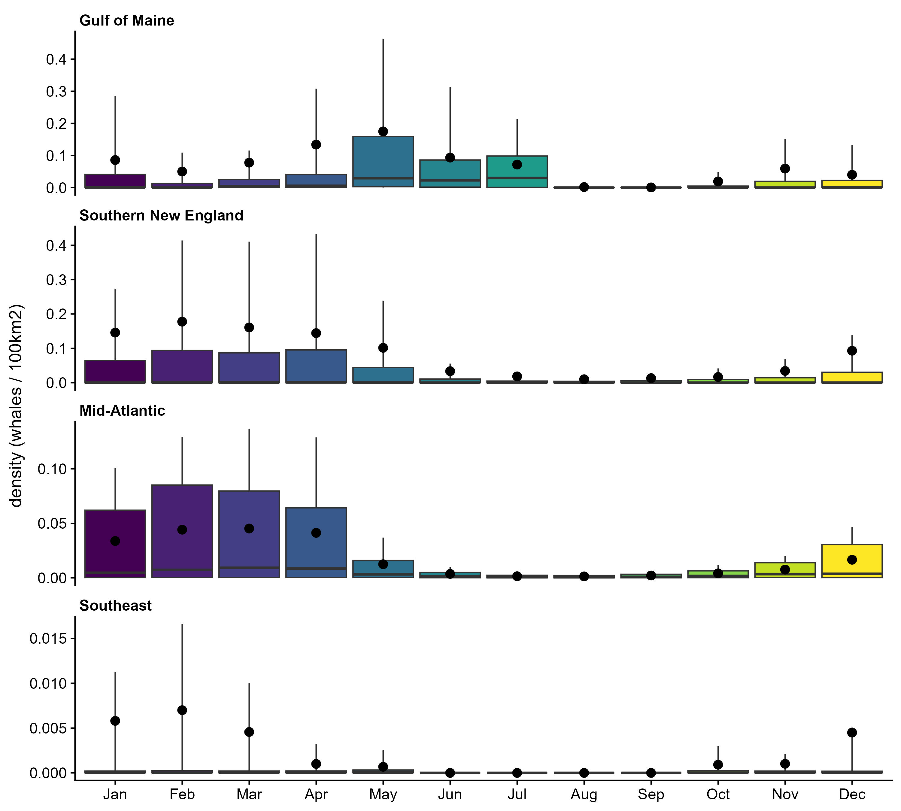
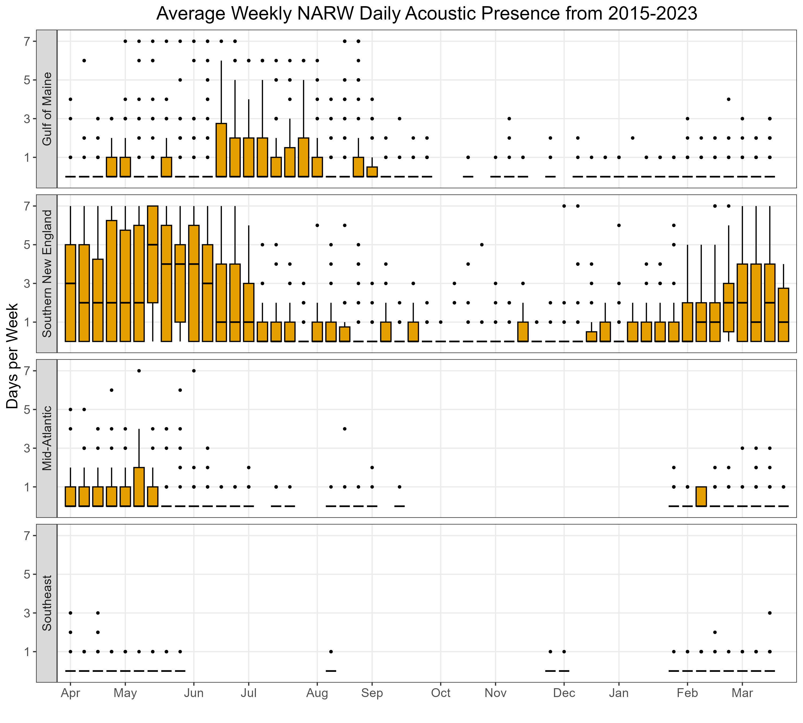

```{r setup, echo = FALSE, message = FALSE}
knitr::opts_chunk$set(echo = FALSE, message = FALSE, warning = FALSE)

# load libraries
library(sf)
library(ggplot2)
library(cowplot)
library(boemWind)
source(here::here('R', 'utils.R'), echo = FALSE)

# Duke color scale
duke_colors = c('#7a0402', '#b01c02', '#d93b07', '#f26518', '#fc9c2d', '#f2c738', '#d0e835', '#a3fc3d', '#65fc6a', '#2deba2', '#24ced4', '#39a8f7', '#4678eb', '#4346ab', '#30123b')

# month order
month_order = c('October', 'November', 'December', 'January', 'February', 'March', 'April', 'May', 'June', 'July', 'August', 'September', 'October2')

# WEA order (roughly North to South)
wea_order = c('OCS-A 0486', 'OCS-A 0517', 'OCS-A 0487', 'OCS-A 0500', 'OCS-A 0501', 'OCS-A 0534', 'OCS-A 0520', 'OCS-A 0521', 'OCS-A 0522', 'OCS-A 0512', 'OCS-A 0544', 'OCS-A 0537', 'OCS-A 0538', 'OCS-A 0539', 'OCS-A 0541', 'OCS-A 0542', 'OCS-A 0549', 'OCS-A 0499', 'OCS-A 0498', 'OCS-A 0532', 'OCS-A 0482', 'OCS-A 0519', 'OCS-A 0490', 'OCS-A 0483', 'OCS-A 0508', 'OCS-A 0545', 'OCS-A 0546')
```

```{r data}
# narw for ggplot2
narw_weas = here::here('data', 'narw_dens_weas.rds') |>
  readr::read_rds() |>
  dplyr::mutate(month = ordered(month, levels = month_order),
                wea = factor(wea, levels = wea_order))
  
# narw for comparison
narw_dens = here::here('data', 'ctoy_density_final.csv') |>
  readr::read_csv() |>
  dplyr::mutate(month = ordered(month, levels = month_order),
                wea = factor(wea, levels = wea_order))

# format data
trigger_data = narw_dens |> 
  dplyr::mutate(`Percentile (90th)` = ifelse(dens_90 > ann_reg_avg, 1, NA),
                `Percentile (75th)` = ifelse(dens_75 > ann_reg_avg, 1, NA),
                `Percentile (50th)` = ifelse(dens_50 > ann_reg_avg, 1, NA),
                Average = ifelse(dens_avg > ann_reg_avg, 1, NA)) |> 
  dplyr::select(-c(dens_90:ann_reg_avg)) |> 
  tidyr::pivot_longer(cols = `Percentile (90th)`:Average, names_to = 'indicator', values_to = 'value') |>
  dplyr::mutate(indicator = factor(indicator, levels = c('Percentile (90th)', 'Percentile (75th)', 'Percentile (50th)', 'Average')))

# ctoy regions
ctoy_regions = here::here('data-raw', 'shapefiles', 'regions', 'CTOY_Investigation.shp') |>
  sf::st_read(quiet = TRUE) 

# BOEM active lease areas
active_weas = boem_wea_outlines |>
  dplyr::filter(LEASE_STAGE == 'Active' & !STATE %in% c('CA', ' Louisanna/Texas') & LEASE_TYPE != 'Easement' & LEASE_NUMBER_COMPANY != 'OCS-A 0506 - The Narragansett Electric Company') |>
  sf::st_transform(crs = sf::st_crs(ctoy_regions))
```

# Approach

Habitat-based North Atlantic right whale (NARW) density models for the U.S. Atlantic were downloaded from [OBIS-SEAMAP](https://seamap.env.duke.edu/models/Duke/EC/). The monthly images were deconstructed into data tables where each row represents a single grid cell, with columns representing attributes of that grid cell (e.g., cell id, cell centroid, cell area, month, density value). We then assigned each grid cell to several, nested areas by spatial intersection between the grid cell centroid and the considered areas polygons. All spatial layers used a bespoke Albers Equal Area coordinate reference system developed by the Marine Geospatial Ecology Lab, Duke University (CetMap_NA). Below are maps of the monthly NARW density data, with superimposed white outlines that denote some of the considered areas.

```{r narw-map, fig.width = 8, fig.height = 8, fig.align = 'left'}
# data for ggplot2
narw_gg = narw_weas |>
  # dplyr::filter(value > 0 | is.na(value)) |>
  dplyr::mutate(x = sf::st_coordinates(geometry)[, 1], y = sf::st_coordinates(geometry)[, 2]) |>
  sf::st_drop_geometry() |>
  dplyr::mutate(fill = cut(value, breaks = c(10, 6.3, 4, 2.5, 1.6, 1, 0.63, 0.40, 0.25, 0.16, 0.10, 0.063, 0.040, 0.025, 0.016, 0), include.lowest = TRUE))

# ggplot2
ggplot(data = narw_gg) + 
  geom_raster(aes(x = x, y = y, fill = fill)) + 
  geom_sf(data = ctoy_regions, fill = 'transparent', color = 'white') +
  geom_sf(data = active_weas, fill = 'transparent', color = 'white') +
  facet_wrap(~month) + 
  theme_cowplot() +
  scale_fill_manual(
    values = rev(duke_colors), 
    guide = guide_legend(reverse = TRUE),
    name = 'whales / 100km2') + 
  coord_sf(crs = sf::st_crs(narw_weas)) + 
  labs(x = NULL, y = NULL) + 
  theme(strip.background = element_blank(), strip.text = element_text(hjust = 0, face = 'bold')) + 
  scale_x_continuous(breaks = c(-80, -70))
```

# Results

Below are boxplots of the monthly NARW densities by active lease area (roughly ordered from north to south). The boxplots were drawn such that the lower whisker represents the 10th percentile, the lower hinge represents the 25th percentile, the dot represents the mean, the line represents the median, the upper hinge represents the 75th percentile, and the upper whisker represents the 90th percentile. Underneath a boxplot are Gantt charts indicating months that should impose temporal restrictions on OWD using several metrics (blue bars):

1)  90th percentile
2)  75th percentile
3)  50th percentile
4)  Average

For all metrics, the blue bar indicates when the monthly value exceeded the average annual density for the respective region. As an example with the 90th percentile, the blue bar would indicate when the 90th percentile of monthly density in a lease area exceeded the average annual density for the respective region. The y-axis of the Gantt charts indicates the degree that active lease areas were buffered (0km = not buffered, 10km = buffered by 10km, and 40km = buffered by 40km).

```{r make-plots, fig.height = 8}
# loop through WEAs
plt_list = purrr::map(.x = wea_order, .f = function(.x) {
  
  # format data
  box_data = narw_weas |> 
    sf::st_drop_geometry() |> 
    dplyr::filter(wea == .x)

  # format data
  dens_data = trigger_data |> 
    dplyr::filter(wea == .x)
  
  # add data for gantt chart
  add_data = expand.grid(month = ordered('October2', levels = month_order), region = unique(dens_data$region), wea = unique(dens_data$wea), constraint = unique(dens_data$constraint), indicator = unique(dens_data$indicator), value = NA)

  # gantt chart
  plt1 = ggplot() + 
    geom_line(data = dplyr::bind_rows(dens_data, add_data), aes(x = month, y = constraint, group = constraint, color = value),  linewidth = 10) + 
    facet_wrap(~indicator) + 
    theme_cowplot() + 
    theme(strip.background = element_blank(), 
          strip.text = element_text(hjust = 0, face = 'bold'),
          panel.spacing = unit(0.75, 'lines')) + 
    labs(x = NULL, y = NULL) + 
    guides(color = 'none') + 
    scale_x_discrete(labels = function(x) substr(x, 1, 1), expand = c(0, 0))
  
  # grab company
  company = active_weas |>
    dplyr::filter(LEASE_NUMBER == .x) |>
    dplyr::pull(LEASE_NUMBER_COMPANY)
  
  # boxplot
  plt2 = ggplot(data = box_data, aes(x = month, y = value, fill = month)) +
    stat_summary(fun.data = boxplot_stat, geom = 'boxplot') + 
    stat_summary(fun = mean, geom = 'point', size = 3) + 
    theme_cowplot() + 
    labs(x = NULL, y = 'density (whales / 100km2)', title = company) + 
    guides(fill = 'none') + 
    scale_x_discrete(labels = function(x) substr(x, 1, 3))
    # + geom_hline(yintercept = 1, linetype = 'dashed') # floor((4 / 100) / 3.429904 * 100)
  
  # add line 
  find_max = box_data |> dplyr::group_by(month) |> dplyr::reframe(values = boxplot_stat(value))
  if (max(find_max$values) > 1) {
    plt2 = plt2 + geom_hline(yintercept = 1, linetype = 'dashed')
  }

  # combine plots
  plot_grid(plt2, plt1, ncol = 1, rel_heights = c(1/2, 1/2), align = 'v', axis = 'left')

})
```

```{r, echo = FALSE, results = 'hide', fig.keep = 'all'}
  print(plt_list)
```

# Compare with PAM

```{r reg-boxplot}
reg_boxplot = ggplot(data = narw_weas |> dplyr::filter(!is.na(region)) |> dplyr::mutate(region = factor(region, levels = c('Gulf of Maine', 'Southern New England', 'Mid-Atlantic', 'Southeast')), month = factor(month, levels = month.name[c(4:12, 1:3)])), aes(x = month, y = value, fill = month)) + 
  stat_summary(fun.data = boxplot_stat, geom = 'boxplot') + 
  stat_summary(fun = mean, geom = 'point', size = 3) + 
  theme_cowplot() + 
  labs(x = NULL, y = 'density (whales / 100km2)') + 
  guides(fill = 'none') + 
  facet_wrap(~region, nrow = 4, ncol = 1, scales = 'free_y') + 
  theme(strip.background = element_blank(), strip.text = element_text(face = 'bold', hjust = 0)) + 
  scale_x_discrete(labels = function(x) substr(x, 1, 3))
ggsave(filename = here::here('R', 'images', 'dens_boxplot_reg.jpg'), plot = reg_boxplot, width = 3000, height = 2700, units = 'px')
```

```{r, figures-side, fig.show = "hold", out.width = "50%"}
knitr::include_graphics(c("images/dens_boxplot_reg.jpg", "images/NARW_Weekly_Presence_OSW-regions_2015-2023.jpg"))
``` 

<!--  -->

<!--  -->
